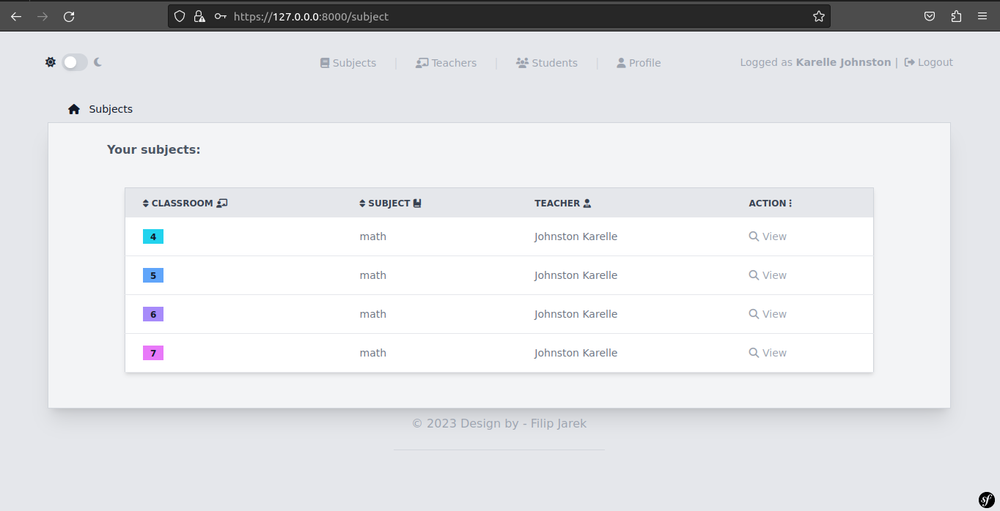
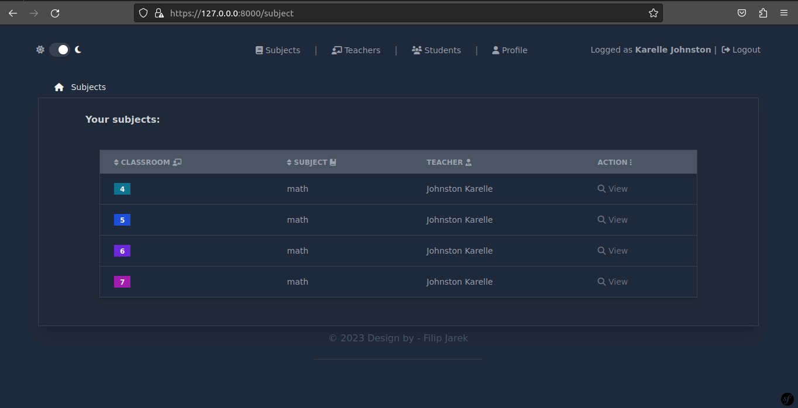
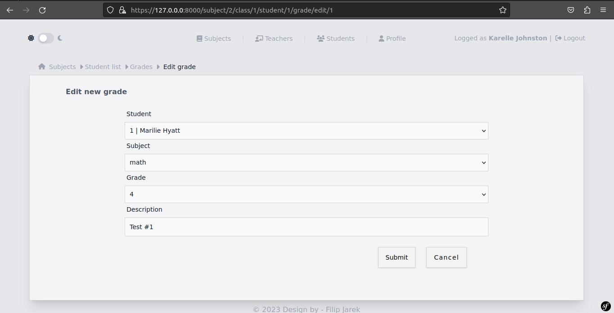
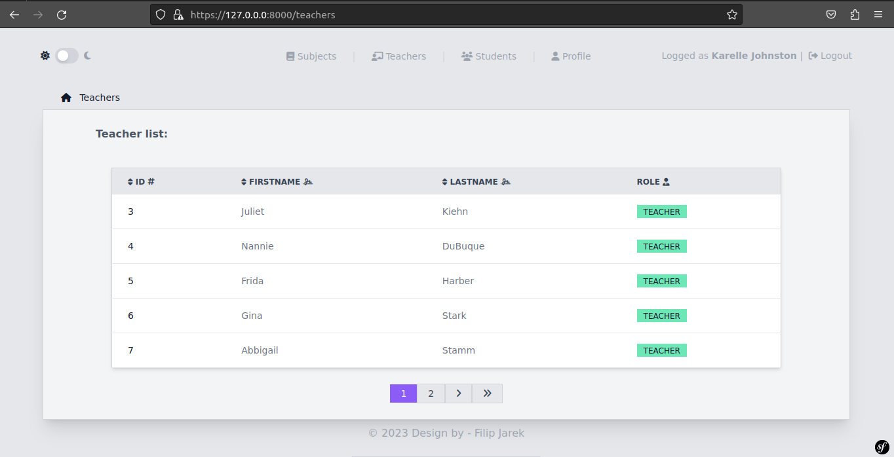
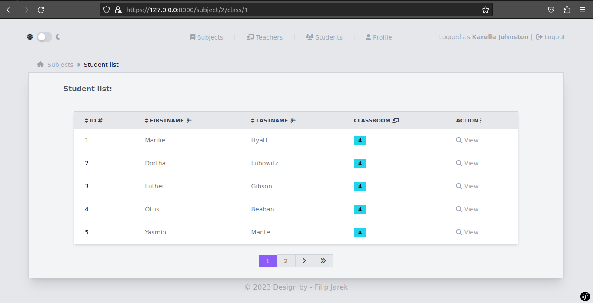

# Gradebook
> A simple web application that works like an electronic gradebook. The system administrator can create teachers, students and assign them specific subjects and class. The teacher can add grades to students in their subject.

## Table of Contents
* [Technologies Used](#technologies-used)
* [Features](#features)
* [Screenshots](#screenshots)
* [Setup](#setup)

## Technologies Used

    Symfony 6.2.6
    PHP 8.2.0
    TailwindCSS 3.2.6
    
    
## Features
List the ready features here:
- Admin control panel (EasyAdmin)
- User login and registration
- App theme selection (light/dark)
- Show teachers and students list
- Creating, editing and deleting: students, classrooms, subjects, grades

## Screenshots











## Setup
#### Step 1 : Clone the project
```
$ git clone https://github.com/filipjarek/gradebook
```
#### Step 2 : Change current directory
```
$ cd gradebook
```
#### Step 3 : Configuration
```
Copy .env.example file to .env on the root folder.
Set the database (mysql) in .env file db_name, db_username and db_password.
```
#### Step 4 : Install dependencies
```
$ composer install
$ npm install
$ npm run build
```
#### Step 5 : Setup database
```
$ php bin/console doctrine:database:create
$ php bin/console make:migration
$ php bin/console doctrine:fixtures:load
```
#### Step 6 : Run the project
```
$ symfony serve -d
```
Open link in your browser: http://localhost:8000:

#### Admin credentails
```
username: admin
password: password
```
